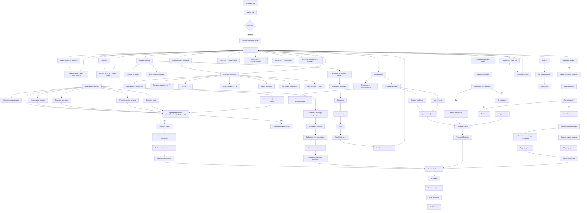
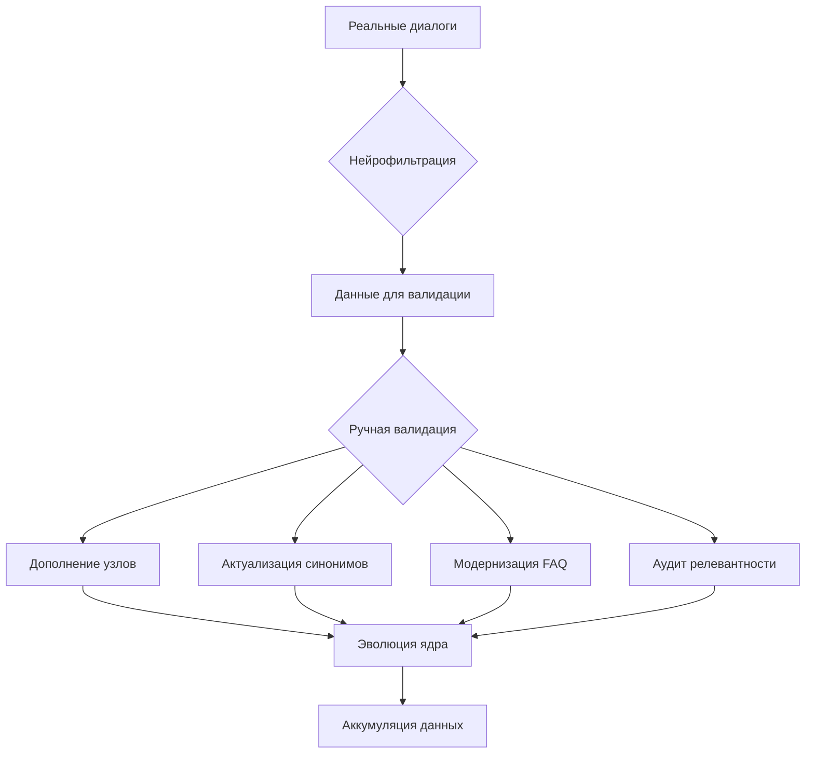

# DialogCore — Диалоговая инфраструктура с ИИ и 500+ узлами

> Масштабируемое ядро поддержки с семантической памятью, ручной калибровкой и ИИ  
> © 2025 — Максим Кырченков | [t.me/kyrchenkov](https://t.me/kyrchenkov)

---

## Назначение

Файлы демонстрируют систему:

- Работает в 4 каналах: Telegram, сайт, мессенджер, соцсеть
- Имеет 500+ узлов с возвратом в поток
- Использует комбинацию: правила, FAQ, ИИ
- Управление через визуальный конструктор
- Прошла ручную калибровку

---

## Архитектура: 3 слоя

| Слой | Технология | Процент запросов |
|------|-----------|------------------|
| **1. Правила + FAQ** | 500+ узлов, условия, маршрутизация | 70% |
| **2. ИИ-обработка** | Интеграция с ИИ-движком | 20% |
| **3. Оператор** | Перевод с контекстом | ≤10% |

## Обзорная схема



---

## Компоненты


### 1. Узлы и маршрутизация
- Формат: `state: newNode_***`
- Поддержка условий: `$conditions.checkIfFitsSchedule`
- Возврат в поток при "прыжках"
- Fallback: `random` — для нераспознанных фраз
- Пример:
  ```
  state: newNode_***
      a: • Самовывоз — бесплатно
         • Экспресс-курьер — *** ₽
         • ТК — от *** ₽
         • Почта России — *** ₽
         Подробнее: example.com/informaciya-o-dostavke
      go!: /newNode_***
  ```

### 2. База знаний (FAQ)
- Формат: [Вопрос] → [Ответ] → [Синонимы]
- Общее: 200 записей
- Синонимов: ~9 400
- Максимум: 1344 синонима на один вопрос

### Общая архитектура

```mermaid
graph TD
    A[ИСТОЧНИКИ ДАННЫХ "(15 файлов)"] --> B[ОБЩАЯ СТАТИСТИКА ДОКУМЕНТОВ]
    B --> B1[• Общий объём: 173 499 слов]
    B --> B2[• Средний объём: ~11 567 слов]
    B --> B3[• Минимальный: 90 слов]
    B --> B4[• Максимальный: 91 818 слов]

    B --> C[СТРУКТУРА БАЗЫ FAQ "(200 записей)"]
    C --> C1[• Формат: [Вопрос] → [Ответ] → [Синонимы]]
    C --> C2[• Общее синонимов: ~9 400]
    C --> C3[• Среднее: ~47 на вопрос]
    C --> C4[• Минимум: 1 "(«Карта сайта»)"]
    C --> C5[• Максимум: 1344 "(«Товар3 на основе Свойства1»)"]

    C --> D[КАТЕГОРИИ КОНТЕНТА]
    D --> D1[Главная категория]
    D1 --> D1a[• Товар 1]
    D1 --> D1b[• Товар 2]
    D1 --> D1c[• Товар 3]
    D1 --> D1d[• Товар 4]
    D1 --> D1e[• Товар 5]

    D --> D2[Категория 1]
    D2 --> D2a[• Доставка курьером]
    D2 --> D2b[• Самовывоз]
    D2 --> D2c[• Доставка ТК]
    D2 --> D2d[• Курьер до двери]
    D2 --> D2e[• Отслеживание]

    D --> D3[Категория 2]
    D3 --> D3a[• Условия оплаты]
    D3 --> D3b[• Способы связи]
    D3 --> D3c[• Личный кабинет]
    D3 --> D3d[• Корзина]
    D3 --> D3e[• Навигация сайт]

    C --> E[ТОП-5 ЗАПРОСОВ ПО СИНОНИМАМ]
    E --> E1[1. Товар 3 на основе Свойства 1 — 1344]
    E --> E2[2. Товар 6 "(Категория 3)" — 674]
    E --> E3[3. Товар 7 "(Категория 4)" — 588]
    E --> E4[4. Товар 8 "(Категория 5)" — 270]
    E --> E5[5. Товар 9 "(Категория 6)" — 297]

    C --> F[ЗОНЫ ПОВЫШЕННОЙ СЕМАНТИЧЕСКОЙ НАГРУЗКИ]
    F --> F1["• Товар на основе Свойства — 4+ варианта формулировок"]
    F --> F2["• Товар в категории — разбито на 15+ подгрупп"]
    F --> F3["• Что такое... — 80+ определений (обучающий блок)"]
    F --> F4["• Где посмотреть... — навигационные команды"]
    F --> F5["• Как выбрать... — фильтрация по Свойству 1, 2 и т.д."]

    C --> G[ВЫВОДЫ ПО АРХИТЕКТУРЕ БАЗЫ]
    G --> G1[Высокая вариативность — до 1344 синонимов]
    G --> G2[Сильный образовательный компонент — 80+ "Что такое..."]
    G --> G3[Поддержка навигации — внутренние ссылки, категории]
    G --> G4[Поддержка новичков — пошаговые инструкции]
    G --> G5[Готовность к росту — структура масштабируется]
    G --> G6[Гибкая кастомизация — синтаксис синонимов]
```

### 3. Интеграция с ИИ
- Используется, когда:
  - Запрос не релевантен компании
  - Но может быть потенциальным лидом
  - Цель — сохранить репутацию
- Механизм:
  ```
  state: newNode_***
      LlmRequest:
          userContent = {{$session.queryText}}
          sendHistory = true
          sendMessage = true
          varName = answerGigaChat
          okState = /newNode_***
          model = GigaChat
          profanityCheckOff = false
  ```

### 4. Каналы интеграции
- Telegram
- Онлайн-чат на сайте (CMS)
- Мессенджер поддержки
- Социальная сеть (ВКонтакте)
- Все ведут в единое ядро диалогов

### 5. Визуальный конструктор
- Управление через Graph — визуальный редактор
- Без кода
- Изменения применяются без перезапуска

### 6. Двухступенчатая фильтрация



### 7. Ручная калибровка
- 6 месяцев разработки
- 6 месяцев ручной калибровки
- На основе реальных диалогов
- Включает:
  - Уточнение узлов
  - Обновление синонимов
  - Проверка релевантности

---
