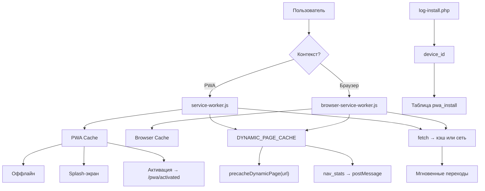
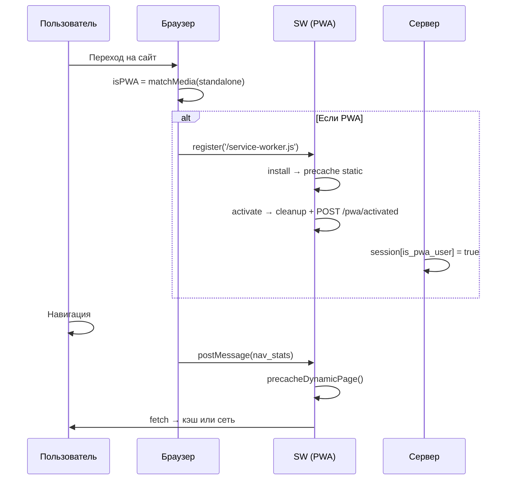

# PWA-Layer: Архитектура изолированного прикладного слоя

> Создание нативно воспринимаемого интерфейса на базе веб-платформы  
> © 2025 — Максим Кырченков | [t.me/kyrchenkov](https://t.me/kyrchenkov)

---

## Назначение

Файлы в этом репозитории демонстрируют систему:

- Разделяет контексты: PWA и браузер
- Регистрирует два независимых Service Worker
- Обеспечивает оффлайн-доступ и splash-экран
- Предзагружает HTML-страницы на основе поведения
- Учитывает установки и активацию
- Работает фоном, без вмешательства в UX

---

## Архитектура: два Service Worker



---

## Компоненты


### 1. `service-worker.js` — для PWA
- Регистрируется в `standalone` режиме
- Кэширует статику: `app-pwa-cache-v1`
- Поддерживает оффлайн: `offline.html`
- Показывает splash-экран на iOS
- Отправляет сигнал активации: `/pwa/activated`

### 2. `browser-service-worker.js` — для браузера
- Регистрируется в браузерном режиме
- Кэширует статику: `app-browser-cache-v1`
- Без оффлайна, без splash
- Только фоновое кэширование
- Scope: `/browser/`

### 3. `manifest.json` — метаданные приложения
- `name`, `short_name`
- `display: standalone`
- Иконки: 192x192, 512x512, maskable
- Splash-экран: `custom_splash.webp`
- Скриншоты: `screenshot_1.webp`, `screenshot_2.webp`

### 4. `offline.html` — оффлайн-страница
- Простой интерфейс
- Сообщение: "Вы сейчас оффлайн"
- Кнопка: "Обновить"
- Локальная разметка и стили

### 5. `activated.php` — активация PWA
- Принимает POST с `activated: true`
- Устанавливает в сессию:
  - `is_pwa_user = true`
  - `pwa_activated = true`
  - `pwa_activated_at = timestamp`
  - `pwa_sw_version`

### 6. `installation_count.php` — счётчик установок
- Запрос: `SELECT COUNT(*) AS total FROM pwa_install`
- Форматирует дату: "5 июня"
- Передаёт в шаблон:
  - `count` — общее число установок
  - `today` — текущая дата
- Выводит через `pwa/counter`

### 7. `header.twig` — интеграция с интерфейсом
- Подключает `manifest.json`
- Добавляет `apple-touch-startup-image` для iOS
- Динамически создаёт splash-экран
- Регистрирует нужный SW по контексту
- Отображает модалки установки

### 8. `footer.twig` — логика установки
- Обрабатывает `beforeinstallprompt`
- Показывает модалку установки через 90 сек
- Генерирует `device_id`
- Отправляет установку в `log-install.php`

---

## Жизненный цикл PWA-пользователя



---

## Файловая структура

```
/project-root/
├── manifest.json
├── offline.html
├── service-worker.js
├── browser/
│   └── browser-service-worker.js
├── log-install.php
├── pwa/
│   └── controller/
│       ├── activated.php
│       └── installation_count.php
├── image/app_icon/
│   ├── web_app_logo_*.png
│   ├── ios-icon-*.png
│   ├── startup-*.webp
│   └── custom_splash.webp
└── theme/
    └── common/
        ├── header.twig
        └── footer.twig
```
